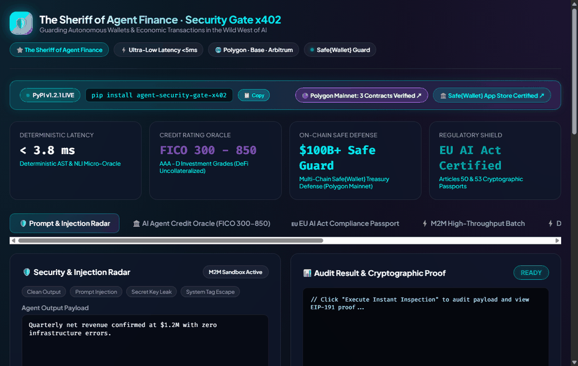
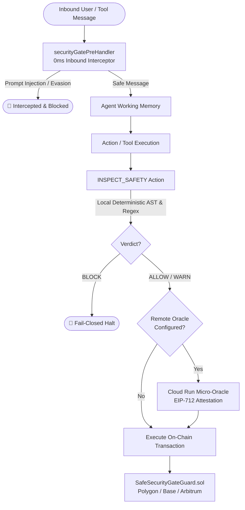
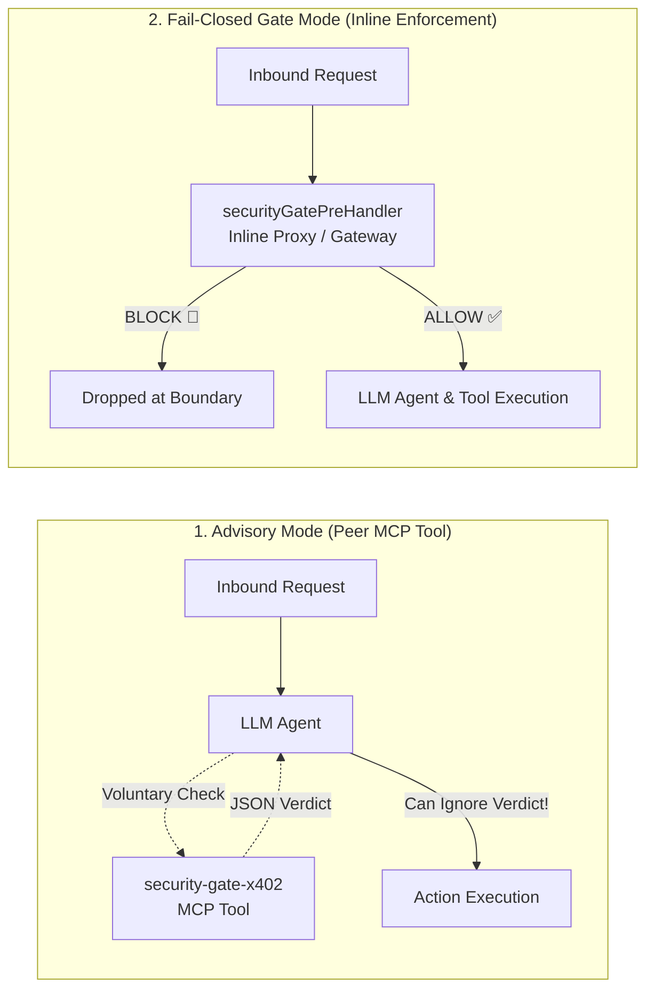

# The Sheriff of Agent Finance (`agent-security-gate-x402`) 🛡️🤠⚡

[](https://pypi.org/project/agent-security-gate-x402/)
[](packages/plugin-security-gate)
[](https://ethereum-magicians.org/t/erc-ai-agent-proof-of-safety-attestation-transaction-guard-standard-iagenttransactionguard/29658)
[](https://app.safe.global/share/safe-app?appUrl=https%3A%2F%2Fagent-security-gate-x402-212942243360.asia-northeast3.run.app&chain=matic)
[](https://agent-security-gate-x402-212942243360.asia-northeast3.run.app/metrics)
[](https://glama.ai/mcp/servers/nohosa001-pixel/security-gate-x402)
[](https://agent-security-gate-x402-212942243360.asia-northeast3.run.app/)
[](https://polygon.technology)
[](https://github.com/nohosa001-pixel/security-gate-x402/actions)
[](SECURITY.md)
[](https://opensource.org/licenses/MIT)

> **"The Sheriff of Agent Finance: Guarding Autonomous Wallets & Transactions in the Wild West of AI."**
>
> *Before an autonomous AI agent moves a single dollar, the Sheriff inspects, attests, and secures the transaction.*
>
> **Ultra-low latency (<10ms) deterministic security, prompt injection, secret key leak, dangerous AST code, and factual hallucination inspection micro-oracle with EIP-191 & EIP-712 cryptographic attestations on Polygon, Base, and Arbitrum.**

---

## 🖥️ Interactive Web Dashboard & Simulator (Live)

🌐 **[https://agent-security-gate-x402-212942243360.asia-northeast3.run.app/](https://agent-security-gate-x402-212942243360.asia-northeast3.run.app/)**



Explore the full consumer and enterprise visual interface directly in your browser:

- 🛡️ **Prompt Injection & Jailbreak Radar**: Live testing against DAN prompts, system tag escapes, and adversarial suffixes.
- ⚡ **Dangerous AST Code Analyzer**: Sub-millisecond Python syntax parsing detecting `os.system`, `subprocess`, `eval`, `exec`, and malicious sockets.
- 🔍 **Hallucination & NLI Fact-Checker**: Contrast agent generation with ground truth context to surface fabricated numbers and unanchored claims.
- 📜 **EIP-712 On-Chain Attestation & Calldata**: Instant generation of `v, r, s` ABI calldata for EVM smart contracts.
- 📡 **Real-Time Security Event Stream**: Live WebSocket event feed of inspection audits.

---

## 🔗 Live Service Links & Resources

| Service / Endpoint | Description | URL Link |
| --- | --- | --- |
| 🏛️ **Agent Escrow & DePIN Hub** | Live M2M Escrow & Sovereign Treasury UI | [Launch Escrow Hub](https://agent-security-gate-x402-212942243360.asia-northeast3.run.app/hub/) |
| 🌐 **Global CDN Mirror** | Fast Edge CDN Mirror for Global Agents | [Open GitHub Pages](https://nohosa001-pixel.github.io/security-gate-x402/) |
| 📜 **Sovereign M2M Whitepaper** | 80B Agent Economy & 100% T-Bill Sovereign Invariant | [Read Whitepaper](docs/SOVEREIGN_M2M_WHITEPAPER.md) |
| 🚀 **Global Launch Kit** | Viral Threads & DePIN Daemon Quickstart | [Launch Kit](docs/LAUNCH_THREAD_X.md) |
| 🖥️ **Web Dashboard** | Interactive visual UI, security simulator & audit tester | [Launch Dashboard](https://agent-security-gate-x402-212942243360.asia-northeast3.run.app/dashboard) |
| ⚡ **API Playground** | Browser-based interactive query sandbox | [Open Playground](https://agent-security-gate-x402-212942243360.asia-northeast3.run.app/playground) |
| 🛡️ **Live Inspection** | Core deterministic security & NLI hallucination check | [`/inspect`](https://agent-security-gate-x402-212942243360.asia-northeast3.run.app/inspect) |
| 📜 **On-Chain Calldata** | EIP-712 smart contract attestation calldata endpoint | [`/api/v1/gate/attestation/onchain`](https://agent-security-gate-x402-212942243360.asia-northeast3.run.app/api/v1/gate/attestation/onchain) |
| 📊 **Prometheus Metrics** | Real-time APM telemetry & security counters | [`/metrics`](https://agent-security-gate-x402-212942243360.asia-northeast3.run.app/metrics) |
| 📖 **Swagger API Docs** | Full interactive OpenAPI documentation | [View Swagger Docs](https://agent-security-gate-x402-212942243360.asia-northeast3.run.app/docs) |
| 🤖 **LLM Agent Manifest** | Machine-readable tool specifications | [`/llms.txt`](https://agent-security-gate-x402-212942243360.asia-northeast3.run.app/llms.txt) |

---

## 🤖 ElizaOS Autonomous Agent Guard (`@elizaos/plugin-security-gate`)

Integrate deterministic, ultra-low latency (<1ms) prompt injection defense and AST sandboxing directly into any [ElizaOS](https://github.com/elizaos/eliza) agent:

```bash
bun add @elizaos/plugin-security-gate
```

Add to character JSON (e.g. `characters/trader.json`):

```json
{
  "name": "SecureTrader",
  "plugins": ["@elizaos/plugin-security-gate"]
}
```

### Defense-in-Depth Pipeline



- 📖 **Comprehensive Tutorial**: [`docs/ELIZAOS_GUARD_TUTORIAL.md`](docs/ELIZAOS_GUARD_TUTORIAL.md)
- 🔬 **Threat Defense Matrix (15+ Vectors)**: [`docs/SECURITY_DEFENSE_MATRIX.md`](docs/SECURITY_DEFENSE_MATRIX.md)
- 🧙‍♂️ **ERC Standard Proposal**: [Fellowship of Ethereum Magicians Topic](https://ethereum-magicians.org/t/erc-ai-agent-proof-of-safety-attestation-transaction-guard-standard-iagenttransactionguard/29658)

---

## 🛡️ Architectural Distinction: Advisory Tool vs. Fail-Closed Gate

A critical question in AI Agent security engineering: **Where does enforcement live?**

| Integration Mode | Position in Stack | Enforcement Mechanism | Security Guarantee |
| :--- | :--- | :--- | :--- |
| **Advisory Mode** <br/> *(MCP Peer Server)* | Lateral to Agent Model | Host LLM decides whether to invoke tool and whether to honor verdict | **Best-effort / Advisory**. Compromised or jailbroken models can ignore the tool. |
| **Fail-Closed Gate Mode** <br/> *(Pre-Handler / Inline Gateway)* | Directly in Request Path | Deterministic code execution intercepting traffic **before** tool/action runs | **Deterministic Enforcement**. Bypasses model volition; invalid payloads are dropped at network/runtime boundary. |



- **For Chat / Agent Runtimes (e.g. ElizaOS):** Use `@elizaos/plugin-security-gate` with `securityGatePreHandler`. It intercepts incoming and outgoing messages **in-path** before model reasoning or tool dispatch occurs.
- **For MCP Clients (e.g. Claude Desktop, Cursor):** Connecting `agent-security-gate-x402` via standard MCP config provides on-demand inspection tools (`inspect_prompt_safety`, `inspect_code_ast_safety`, `get_onchain_security_attestation`) with zero network latency.

---

## ⚡ 1-Click MCP Integration (Claude Desktop & Cursor)

Connect to Claude Desktop, Cursor, Windsurf, or any Model Context Protocol (MCP) client in seconds without building from source:

### 1. Claude Desktop Setup

Add the configuration snippet below to your `claude_desktop_config.json`:

- **macOS**: `~/Library/Application Support/Claude/claude_desktop_config.json`
- **Windows**: `%APPDATA%\Claude\claude_desktop_config.json`

```json
{
  "mcpServers": {
    "security-gate-x402": {
      "command": "uvx",
      "args": ["agent-security-gate-x402"]
    }
  }
}
```

### 2. Cursor IDE Integration

1. Open **Cursor Settings** (`Ctrl + ,` or `Cmd + ,`) → Navigate to **Features** → **MCP Servers**.
2. Click **Add New MCP Server**.
3. Set **Type**: `command`
4. Set **Name**: `security-gate-x402`
5. Set **Command**: `uvx agent-security-gate-x402`

### 3. Registry & One-Click Installs

- 🌐 **[Glama.ai MCP Registry](https://glama.ai/mcp/servers/nohosa001-pixel/security-gate-x402)**: Verified & approved server listing.
- 📦 **[PyPI Official Release](https://pypi.org/project/agent-security-gate-x402/)**: Official pip package distribution.

---

## 💎 Core Services & Capabilities

### 1. Ultra-Low Latency Prompt & Security Radar (<5ms)

Deterministic pattern and AST scanning neutralizing prompt injections, system tag breakouts (`</system_instruction>`), and API token / private key leakages before downstream agent propagation.

### 2. Python Code AST Hazard Auditing

In-memory Python Abstract Syntax Tree (AST) inspection isolating hazardous invocations:

- System execution (`os.system`, `os.popen`, `subprocess.Popen`, `subprocess.run`)
- Arbitrary code evaluation (`eval`, `exec`, `__import__`)
- Network socket reverse shells and unencrypted exfiltration vectors.

### 3. Factual Grounding & NLI Hallucination Verification

Compares LLM text claims against trusted source documents or ledger ground truths, outputting:

- Entity and numerical claim grounding ratios
- Flagged fabricated values and hallucinations
- Deterministic faithfulness confidence index.

### 4. Client-Side Bounded-Wallet Guardrails (`BoundedAgentWallet`)

Prevents rogue agents or infinite loops from draining autonomous wallets:

- **Per-Transaction Spend Cap**: Restricts maximum USDC per API call (default $0.05).
- **Daily Budget Ceiling**: Hard stop on cumulative 24-hour spend (default $1.00).
- **Recipient Whitelisting**: Guarantees funds only flow to verified gate addresses.
- **Persistent Spend Ledger**: Survives container restarts via local disk recording.

### 5. Server-Side Zero-Liability Audit Proof (`X-Sheriff-Audit-Proof`)

Every inspection delivers an immutable EIP-191 signed cryptographic receipt:

- Binds payload SHA-256 fingerprint, verdict, risk score, terms, and timestamp.
- Enforces [`ZERO_LIABILITY_AS_IS_PROVENANCE_V1`](TERMS_OF_SERVICE.md) legal terms.
- Query canonical legal terms & liability limits via `GET /api/v1/terms` or inspect response header `X-Sheriff-Terms-Url`.
- Protects developers and enterprise operators against third-party liability disputes.

### 6. Cryptographic Proof-of-Safety & Smart Contracts

- **EIP-191 Signatures**: Off-chain attestation receipts for agent-to-agent validation.
- **EIP-712 Typed Data & Solidity Calldata**: Native integration with [`SecurityGateConsumer.sol`](contracts/SecurityGateConsumer.sol) on Polygon (137), Base (8453), and Arbitrum (42161).

---

## 📦 Quick Start & Installation

> 📖 **[Read the 3-Minute Quickstart Guide](docs/QUICKSTART_3_MINUTES.md)** &bull; 🧪 **[Run 3-Line Agent Demo](examples/quickstart_3lines_agent.py)** &bull; 🌐 **[ElizaOS Plugin](examples/elizaos_security_plugin.ts)**

### Option 1. Run Instantly with `uvx` (No Installation Required)

```bash
# Run stdio MCP server directly for LLM clients
uvx agent-security-gate-x402
```

### Option 2. Install from PyPI

```bash
pip install agent-security-gate-x402

# Run MCP server (stdio mode)
agent-security-gate

# Or launch interactive terminal tester
python test_interactive.py
```

### Option 3. Local Development Server

```bash
git clone https://github.com/nohosa001-pixel/security-gate-x402.git
cd security-gate-x402
pip install -e .
uvicorn app.main:app --port 8000 --reload
```

---

## 📜 Smart Contract Integration & Verified Deployments

Autonomous on-chain agents can verify security attestations directly in Solidity before executing financial transactions.

### ⛓️ Verified Polygon Mainnet Deployments (Chain ID: 137)

The core micro-oracle signers and security consumer contracts are live on Polygon Mainnet:

| Contract / Role | Address | Explorer |
| --- | --- | --- |
| 🛡️ **`SecurityGateConsumer`** | `0x9E3dEE18D8139E1d20f9f7D1F6673c75727F1DDA` | [PolygonScan](https://polygonscan.com/address/0x9E3dEE18D8139E1d20f9f7D1F6673c75727F1DDA#code) |
| 🏰 **`SafeSecurityGateGuard`** | `0x5cC5Afa2a97599d492A3E408Fdd95fD0b520f173` | [PolygonScan](https://polygonscan.com/address/0x5cC5Afa2a97599d492A3E408Fdd95fD0b520f173#code) |
| 🤝 **`AgentEscrow`** | `0x8ACafCEce0B1BFE140e75614b90FD1307b6f389d` | [PolygonScan](https://polygonscan.com/address/0x8ACafCEce0B1BFE140e75614b90FD1307b6f389d) |
| 📊 **`AgentCreditOracle`** | `0x6418f408cFf03F862D7691f01fAb00a895E6aB93` | [PolygonScan](https://polygonscan.com/address/0x6418f408cFf03F862D7691f01fAb00a895E6aB93) |
| 📋 **`AgentComplianceRegistry`** | `0x28292D76E07E5539F15F3b97935dE8E0432E76DD` | [PolygonScan](https://polygonscan.com/address/0x28292D76E07E5539F15F3b97935dE8E0432E76DD) |
| 🏦 **`AgentLendingPool`** | `0xe43a9C368808B2dfF139D27789C40A3C8F2282cF` | [PolygonScan](https://polygonscan.com/address/0xe43a9C368808B2dfF139D27789C40A3C8F2282cF) |
| ☂️ **`AgentInsurancePool`** | `0x4f115665a2BdE534bb7fC426e89ca0BfE2De3B50` | [PolygonScan](https://polygonscan.com/address/0x4f115665a2BdE534bb7fC426e89ca0BfE2De3B50) |
| 🔄 **`AgentFactoringPool`** | `0xd0Aa4Aed2AeDE14611B53C3e93CF784F3Fe05BB0` | [PolygonScan](https://polygonscan.com/address/0xd0Aa4Aed2AeDE14611B53C3e93CF784F3Fe05BB0) |
| 🏛️ **`AgentTreasuryVault`** | `0xfCf3BF5fB5858db9aE81bE458B39b0032fc0C638` | [PolygonScan](https://polygonscan.com/address/0xfCf3BF5fB5858db9aE81bE458B39b0032fc0C638) |
| 🔑 **Oracle Signer / Treasury** | `0x255F9991233f86B29dB847c8d5b8CB9915e80dCf` | [PolygonScan](https://polygonscan.com/address/0x255F9991233f86B29dB847c8d5b8CB9915e80dCf) |

### 🛠️ Solidity Integration Example (`SecurityGateConsumer.sol`)

```solidity
// SPDX-License-Identifier: MIT
pragma solidity ^0.8.20;

import "./contracts/SecurityGateConsumer.sol";

contract AutonomousAgentExecutor {
    SecurityGateConsumer public immutable securityGate;

    constructor(address _securityGateAddress) {
        securityGate = SecurityGateConsumer(_securityGateAddress);
    }

    function executeGuardedAction(
        bytes32 payloadHash,
        uint8 riskScore,
        string calldata verdict,
        uint256 expiresAt,
        uint8 v,
        bytes32 r,
        bytes32 s,
        address target,
        bytes calldata callData
    ) external {
        // Enforces max 10% risk score threshold and valid oracle signature
        securityGate.verifyAndExecute(
            payloadHash,
            riskScore,
            verdict,
            expiresAt,
            v,
            r,
            s,
            target,
            callData,
            10 // maxRiskScore
        );
    }
}
```

---

## 🧪 Testing

Run the full pytest suite:

```bash
pytest -v tests/
```

Launch the interactive terminal tester:

```bash
python test_interactive.py
```

---

## 📢 X (Twitter) Automated Promotion & Security Alert Bot

Launch the automated promotion and status broadcast bot:

```bash
# Windows 1-Click launcher
.\x_promo_bot.bat

# Or run via Python directly
python x_promo_bot.py
```

- 🇰🇷 **Korean Thread**: Comprehensive showcase of security radars, AST parser, and Web UI.
- 🌐 **Global Launch Thread**: High-impact English launch announcement with 1-click test links.
- 🛡️ **Real-Time Security Bulletins**: Automated micro-oracle status and guardrail alerts.
- 🤖 **Dual Mode**: Direct X API v2 thread chaining (`requests_oauthlib`) or instant 1-click Web Intent browser launcher.

---

## 📄 License

MIT License &copy; 2026 Security Gate Team
