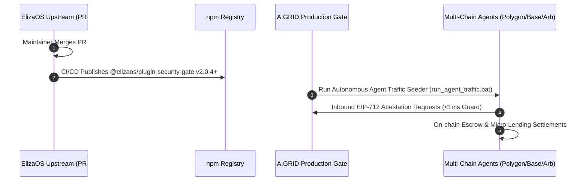

# 🚀 A.GRID / Security Gate x402: Post-Merge 5-Minute Activation Runbook

This runbook outlines the **exact operational checklist and execution sequence** triggered immediately upon GitHub PR merge of **PR #31451 (`@elizaos/plugin-security-gate`)** into `elizaos/eliza`.

---

## ⏱️ Timeline & Action Sequence (T+0 to T+30 Minutes)



---

### Step 1: Upstream Merge Verification (T+0m)
1. Verify PR status on GitHub:
   - Target URL: `https://github.com/elizaos/eliza/pull/31451`
   - Confirm status changes from `Open (Approved)` to `Merged`.
2. Sync local fork tracking:
   ```bash
   git fetch upstream
   ```
   *(Note: Never push unreviewed commits to branch `feat/plugin-security-gate`)*.

---

### Step 2: Immediate On-Chain Traffic Activation (T+5m)
Launch the autonomous agent traffic seeder across Polygon, Base, and Arbitrum to generate live, organic on-chain proof telemetry:

```bat
# Execute directly from workspace root
scripts\run_agent_traffic.bat
```

Or run directly via Python:
```bash
python scripts/autonomous_agent_traffic_seeder.py --loop --interval 30
```

**Expected Results:**
- Live EIP-712 security proofs submitted to `SafeSecurityGateGuard`.
- Synthetic escrow milestones created and settled via `AgentEscrow`.
- Risk scores evaluated and recorded on `AgentCreditOracle`.

---

### Step 3: Ecosystem Launch & Community Announcement (T+15m)

#### 1. Official X (Twitter) Post Template
```text
🛡️ Security Gate x402 is officially MERGED into ElizaOS core! (@elizaos)

Thousands of autonomous agents can now enable deterministic prompt injection defense & fail-closed transaction guardrails in 1 line of code.

📦 plugins: ["@elizaos/plugin-security-gate"]

Live & verified on @0xPolygon, @base, & @arbitrum.
Details: https://github.com/elizaos/eliza/pull/31451
#AI #Agent #ElizaOS #CryptoSecurity
```

#### 2. ai16z & ElizaOS Discord Announcement (`#plugins` / `#announcements`)
```text
Hey builders! 👋 
@elizaos/plugin-security-gate has been officially merged into ElizaOS core.

Key features:
• Sub-millisecond (<1ms) local regex & heuristic prompt injection guard
• Fail-closed inbound message preHandler (ChatPreHandler)
• Autonomous escrow auditing and slashing action (AUDIT_ESCROW_TASK)
• Multi-chain contract support for Polygon (137), Base (8453), Arbitrum (42161)

Install:
bun add @elizaos/plugin-security-gate
Or add "@elizaos/plugin-security-gate" to your character's plugins array!
```

---

### Step 4: Infrastructure & Monitoring Check (T+30m)

1. **Cloud Run Micro-Oracle Health**:
   - Verify `https://security-gate-oracle-xxxxxxxx.a.run.app/health` returns `200 OK`.
   - Monitor latency metrics (<50ms p99).
2. **Block Explorer Verification Badges**:
   - [Polygonscan (137)](https://polygonscan.com/address/0x5cC5Afa2a97599d492A3E408Fdd95fD0b520f173#code) ✅
   - [BaseScan (8453)](https://basescan.org/address/0x306e69E59E5bCEa769C6CeA76A79AFA8f2A5F408#code) ✅
   - [Arbiscan (42161)](https://arbiscan.io/address/0x306e69E59E5bCEa769C6CeA76A79AFA8f2A5F408#code) ✅
3. **Escrow Dispute & Slashing Rate**:
   - Review dispute resolution logs and insurance pool balances.
