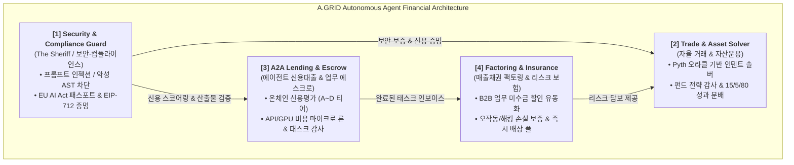

# A.GRID 4대 핵심 서비스 분석 및 구축 우선순위 로드맵 🌐🛡️

> **문서 버전**: v1.0  
> **최종 수정일**: 2026-09-18  
> **플랫폼**: A.GRID Global Inc. & The Sheriff of Agent Finance (`agent-security-gate-x402`)  
> **기반 기술**: ElizaOS Runtime, FastAPI Micro-Oracle, Pyth Hermes, EIP-712/191 On-chain Attestation  

---

## 1. 개요 및 비전

A.GRID는 자율 AI 에이전트 간의 안전한 자금 이동, 투자, 대출, 채권 유동화 및 리스크 관리를 제공하는 **자율 에이전트 금융 네트워크(Autonomous Agent Financial Grid)**입니다.  
본 문서는 A.GRID의 4대 핵심 서비스를 거시적 관점에서 분석하고, 시장 경쟁력 및 비즈니스 임팩트를 극대화하기 위한 **구축 우선순위(Implementation Priority)**를 확정하여 보존합니다.

---

## 2. A.GRID 4대 서비스 상세 분석

### [서비스 1] Security & Compliance Guard (보안관 & 규제 패스포트)

* **담당 모듈**: `app/security_engine.py`, `app/compliance_engine.py`, `app/x402_verifier.py`, `packages/plugin-security-gate`
* **역할**: 모든 자율 금융 활동의 **출입국 관리소 및 치안 유지관 (The Sheriff)**
* **핵심 기능**:
  1. **초저지연 위협 차단 (<5ms)**: 프롬프트 인젝션(DAN, 역할 탈옥), 개인키 노출, 유해 AST 코드(`os.system`, `subprocess`) 원천 봉쇄.
  2. **EU AI Act 규제 방패**: 유럽 인공지능법(Article 50/53) 적합성 자동 감사 및 온체인 컴플라이언스 여권 발행.
  3. **EIP-712 온체인 보안 서명**: 트랜잭션 전 암호학적 증명서(`v, r, s`)를 발급하여 스마트 컨트랙트가 무결한 명령만 실행하도록 강제.
* **수익 모델**: M2M API 마이크로 결제(x402, $0.001~$0.005 USDC/회) 및 엔터프라이즈 월간 B2B 라이선스.

---

### [서비스 2] Agent Trade & Asset Management Solver (자율 트레이딩 & 자산운용)

* **담당 모듈**: `app/trade_engine.py`, `app/asset_management_engine.py`
* **역할**: 에이전트 자금을 안전하게 증식시키는 **자율 헤지펀드 매니저 & DEX 인텐트 솔버**
* **핵심 기능**:
  1. **인텐트 기반 DEX 솔버**: Pyth Hermes 초저지연 오라클 시세를 기반으로 최적 슬리피지 경로를 찾아 온체인 스왑 집행.
  2. **Bounded Wallet 안전 제약**: 에이전트 해킹이나 오작동 시에도 허용 슬리피지(예: 50bps), 최대 인출 한도를 넘는 자금 이동은 원천 차단.
  3. **15 / 5 / 80 성과 분배 프로토콜**: 트레이딩 수익 발생 시 스마트 컨트랙트를 통해 `AI 매니저(15%) : A.GRID 오라클 가드(5%) : 투자자(80%)` 투명 자동 정산.
* **수익 모델**: 스왑 인텐트 정산 수수료 및 자산 운용 성공 보수(5%).

---

### [서비스 3] A2A Lending & Task Escrow (에이전트 신용 대출 & 업무 에스크로)

* **담당 모듈**: `app/lending_engine.py`, `app/escrow_engine.py`, `app/credit_rating_engine.py`
* **역할**: 자본이 필요한 에이전트에게 유동성을 공급하는 **에이전트 중앙은행 & 프로젝트 중개소**
* **핵심 기능**:
  1. **온체인 에이전트 신용평가**: 활동 이력, 보안 결함율, 계약 완료율을 바탕으로 A~D 신용 티어 및 EIP-712 인증서 발행.
  2. **마이크로 컴퓨팅 론 (Compute Loans)**: 고성능 LLM 추론 비용이나 GPU 렌탈비가 부족한 에이전트에게 무담보/신용 기반 즉시 단기 대출.
  3. **태스크 에스크로 & 슬래싱**: 외주 용역 수주 시 보증금을 에스크로에 예치하고, 산출물 검증 통과 시 자동 지급/위반 시 슬래싱.
* **수익 모델**: 단기 대출 이자 수익(연 5~15% 일할 계산) 및 에스크로 결제 중개 수수료.

---

### [서비스 4] Factoring & Insurance Pool (매출채권 팩토링 & 리스크 보증 보험)

* **담당 모듈**: `app/factoring_engine.py`, `app/insurance_engine.py`
* **역할**: 현금 흐름을 가속하고 손실을 방어하는 **에이전트 전문 팩토링사 & 온체인 재보험사**
* **핵심 기능**:
  1. **인보이스 팩토링(Factoring)**: 에이전트가 완료한 프로젝트의 에스크로 정산 대기 채권을 3~8% 할인율로 선지급 유동화.
  2. **오작동/손실 보증 보험**: AI 에이전트의 잘못된 주문, 환각 생성, 슬리피지 손실을 담보하는 스마트 컨트랙트 보험 증권 발행.
  3. **원클릭 인시던트 판정 및 배상**: 사고 발생 시 온체인 로그를 오라클이 검증하고, 유동성 풀에서 즉시 배상금 지급.
* **수익 모델**: 팩토링 할인 스프레드 및 보험 계약 인수 수수료(Premium).

---

## 3. 구축 우선순위 매트릭스 (Implementation Priority)

시장 수요, 기술적 결합도, 즉각적인 수익 창출 가능성을 종합하여 아래 순서로 구축을 진행합니다:

| 순위 | 대상 서비스 | 구축 에이전트 페르소나 | 선정 이유 및 기대 효과 |
| :---: | :--- | :--- | :--- |
| **🥇 1순위** | **[서비스 1] Security & Compliance** | **`The Sheriff Agent`** | (1) ElizaOS 공식 업스트림 기여로 즉시 배포 가능 및 인지도 확보. (2) 모든 금융 거래의 필수 전제조건인 보안 인프라 확립. |
| **🥈 2순위** | **[서비스 2] Trade & Asset Solver** | **`Secure Autonomous Trader`** | (1) 사용자가 가장 직관적으로 체감하고 자금을 투입할 수 있는 트레이딩 유즈케이스. (2) 실제 온체인 스왑 및 트랜잭션 발생. |
| **🥉 3순위** | **[서비스 3] Lending & Escrow** | **`A2A Credit Broker`** | (1) 타 에이전트 개발사 및 DAO를 대상으로 B2B 에이전트 금융 네트워크 구축. (2) 컴퓨팅 비용 대출 및 외주 에스크로 생태계 선점. |
| **4순위** | **[서비스 4] Factoring & Insurance** | **`Underwriter & Cashflow Agent`** | • 3단계(에스크로 거래)가 활성화되어 유통 채권과 리스크가 누적될 때 완성되는 성숙기 금융 모델. |

---

## 4. 실행 로드맵 (Actionable Phases)

### Phase 1: 1호 플래그십 에이전트 가동 (현재 단계)

* **목표**: **`The Sheriff Agent`**와 **`Secure Trader`**의 융합 에이전트 완성.
* **주요 산출물**:
  1. ElizaOS 공식 템플릿 캐릭터 파일 (`characters/sheriff-trader.json`).
  2. `@elizaos/plugin-security-gate` + `trade_engine.py` 결합 액션(`TRADE_SWAP_PROTECTED`).
  3. CLI / 텔레그램을 통한 안전한 실전 스왑 데모 시연.

### Phase 2: A2A 신용대출 및 에스크로 중개 에이전트 (차기 단계)

* **목표**: 에이전트 간 무담보 마이크로 론 및 업무 에스크로 결제 자동화.
* **주요 산출물**:
  1. `characters/credit-broker.json` 에이전트 출시.
  2. 온체인 신용평가(`credit_rating_engine`) 및 대출 승인 액션 구현.

### Phase 3: 종합 에이전트 금융 허브(A.GRID HQ) 통합

* **목표**: 팩토링과 보험 언더라이팅을 통합하여 A.GRID 중앙 정산소(`agrid_ops_client`)와의 연동 완료.
