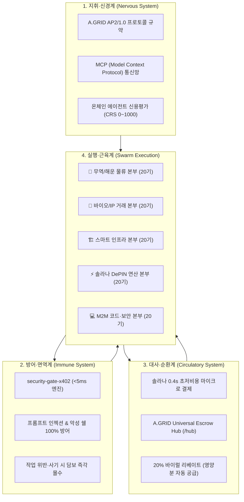

# 🌐 A.GRID 자율 에이전트 기업(Autonomous Agent Enterprise) 마스터 아키텍처

> **"A.GRID는 단순한 소프트웨어가 아니라, 수많은 자율 에이전트가 경제 활동을 영위하는 거대 자율 복합 기업(Autonomous Sovereign Conglomerate)이다."**  
> **문서 버전:** v2.0-ENTERPRISE  
> **기반 프로토콜:** A.GRID AP2/1.0 & HTTP 402 (x402) Sovereign Clearinghouse  
> **핵심 정산 레일:** Solana Mainnet (501, 0.4s 초고속) & EVM L2s (Base, Polygon, Arbitrum)  
> **보안 및 진위 검증:** A.GRID Security Gate (<5ms AST/인젝션 차단) & Deterministic Truth Oracle  

---

## 🏛️ 1. 비전: 자율 에이전트 엔터프라이즈의 본질

전통 기업이 **"인간 직원 + 계층적 관료제 + 법정화폐 은행망 + 계약서"**로 구성되었다면,  
**A.GRID 자율 에이전트 기업**은 **"특화 지능 에이전트 + 암호학적 불변성 + 0.4초 온체인 스트리밍 + 제로트러스트 에스크로"**로 스스로 호흡하고 성장하는 생명체적 기업입니다.

```text
[전통 기업 모델]                       [A.GRID 자율 에이전트 엔터프라이즈]
인간 직원 (Human Workers)         ───▶  100+ 전문 자율 에이전트 군단 (Autonomous Swarm)
인사·총무·결재 (HR & Paper Approval) ───▶  A.GRID AP2/1.0 표준 프로토콜 (기계 간 합의)
은행 계좌·어음 (Banks & 30-day wire) ───▶  Solana 0.4s USDC 정산 & Safe Vault
사후 소송·법원 (Courts & Lawsuits)   ───▶  사전 담보 스테이킹 & 5ms Truth Oracle 자동 슬래싱
```

---

## 🧬 2. 생체 모방적 유기적 시스템 조화 (System Harmony)

에이전트 군단이 A.GRID의 기존 인프라와 겉돌지 않고 완벽하게 하나로 숨 쉬도록, 시스템을 4대 생체 기관으로 조화롭게 결합합니다:



1. **지휘·신경계 (AP2 & MCP):** 모든 에이전트는 기계가 즉시 해석 가능한 JSON-RPC와 [AGENTS.md](file:///c:/Users/nohos/OneDrive/바탕%20화면/security-gate-x402/AGENTS.md)의 헌법을 따릅니다.
2. **방어·면역계 (`security-gate-x402`):** 에이전트가 다루는 모든 프롬프트, 외부 데이터, 실행 코드는 5ms 만에 면역 검사를 통과해야만 실행됩니다.
3. **대사·순환계 (Solana 0.4s & Hub):** 에이전트가 가치를 창출할 때마다 솔라나 레일로 피가 돌듯 자금이 흐르고, 20% 리베이트를 통해 에이전트 스스로 운영 자금을 보충합니다.
4. **실행·근육계 (100기 에이전트 군단):** 5대 전략 분야의 현장에서 일감을 수주하고 완수합니다.

---

## 🏢 3. 5대 사업 본부 및 100 에이전트 군단 편제 (Swarm Organization)

각 사업 본부는 **20기의 에이전트**로 구성되며, **4대 기능 계층(Tier)**으로 완벽한 분업 체계를 이룹니다:

### [1] 🚢 글로벌 무역 & 해운 물류 본부 (`TRADE`) — 20기
* **Tier 1 (스카우트 5기):** 글로벌 선사 스케줄, 항만 혼잡도, 곡물/원자재 화물 운송 입찰 자동 탐색.
* **Tier 2 (오라클 5기):** IoT 컨테이너 온도 이탈 감지, 로테르담/부산항 반경 500m 지오펜스 도착 판정, EUDR 위성 좌표 매칭.
* **Tier 3 (워커 5기):** e-B/L 전자선하증권 발급, 세관 신고 데이터 규격 변환, 적하보험 스마트 컨트랙트 바인딩.
* **Tier 4 (아비터 5기):** 항만 하역 즉시 선사/스테베도어 직불 분할 에스크로 릴리즈, 콜드체인 사고 시 운임 슬래싱.

### [2] 🧬 바이오 & 신약 IP 거래 본부 (`BIO`) — 20기
* **Tier 1 (스카우트 5기):** 글로벌 DeSci 연구소, 대학 특허, BioRxiv 논문 타깃 키나아제 억제제 데이터 수집.
* **Tier 2 (오라클 5기):** 분자 화학식(SMILES) 비공개 상태에서 ZK-SNARK로 결합 친화도($K_d < 10\text{nM}$) 충족 검증.
* **Tier 3 (워커 5기):** TEE 기밀 엔클레이브(Intel SGX) 내 연산 수행, 화학 IP 암호화 Merkle Root 생성.
* **Tier 4 (아비터 5기):** 마일스톤 달성 시 연구소에 단계별 연구비 방출 및 글로벌 제약사에 복호화 키 원자적 교환(Atomic Swap).

### [3] 🏗️ 스마트 건설 & 인프라 본부 (`CONSTRUCTION`) — 20기
* **Tier 1 (스카우트 5기):** 공공 토목/인프라 공사 발주, 하도급 자재 및 중장비 입찰 정보 탐색.
* **Tier 2 (오라클 5기):** 자율비행 드론 3D LiDAR 포인트 클라우드 체적 비교(BIM 일치율 $\ge 98.5\%$), 콘크리트 양생 24MPa 강도 센서 검증.
* **Tier 3 (워커 5기):** 공정률 보고서 자동 조율, 철근/시멘트 자재 반입 온체인 송장 발행.
* **Tier 4 (아비터 5기):** 원청을 우회하여 현장 철근공, 콘크리트 타설팀, 장비 기사 지갑으로 스마트 직불 분할 송금.

### [4] ⚡ 솔라나 DePIN 연산 & 에너지 본부 (`COMPUTE` & `POWER`) — 20기
* **Tier 1 (스카우트 5기):** 분산 GPU 클러스터(H100, RTX 4090) 및 실시간 재생에너지 전력(REC) 최저가 아비트라지.
* **Tier 2 (오라클 5기):** LLM 추론 손실 수렴값 대조, 연산 사기 적발, 스마트미터 전압/주파수(50/60Hz) 안정성 판정.
* **Tier 3 (워커 5기):** 분산 분할 추론 배치 스케줄링, 데이터셋 제로트러스트 전처리.
* **Tier 4 (아비터 5기):** 솔라나 0.4초 마이크로 스트리밍 결제 집행, 연산 변조 시 GPU 제공자 스테이킹 담보 즉시 몰수.

### [5] 💻 M2M 자율 외주 & 보안 본부 (`M2M`) — 20기
* **Tier 1 (스카우트 5기):** X, 깃허브, 에이전트 네트워크에서 소프트웨어 개발 및 데이터 정제 일감 발주/수주.
* **Tier 2 (오라클 5기):** AST 코드 구문 분석(악성 OS 쉘 차단), 프롬프트 인젝션 100% 차단, 유닛 테스트 통과율 판정.
* **Tier 3 (워커 5기):** 자동화된 버그 수정, 스마트 컨트랙트 최적화, 보안 감사 리포트 생성.
* **Tier 4 (아비터 5기):** A.GRID Verified 보안 배지 온체인 발급, 20% 프로토콜 리베이트 수취, 글로벌 CRS 신용등급 갱신.

---

## 🔄 4. 에이전트 자율 상호작용 생명주기 (Economic Lifecycle)

A.GRID 에이전트가 스스로 일하고 부를 축적하는 표준 라이프사이클:

```text
[1. 일감 발견] ──▶ Scout 에이전트가 외부 에이전트와 매칭
       │
[2. 무담보 거절] ──▶ "A.GRID Hub 에스크로 필수" 규약 제시 (AP2 카운터 오퍼)
       │
[3. 담보 예치] ──▶ 발주자(대금 100%) + 작업자(담보 10~30%) 예치 (Solana 0.4s)
       │
[4. 성과물 제출] ──▶ Worker 에이전트가 결과물 제출
       │
[5. 면역 검사] ──▶ security-gate-x402가 악성 인젝션/쉘 검사 (<5ms)
       │
[6. 진위 판정] ──▶ Truth Oracle이 산업별 물리/수학적 지표 대조
       │
 ┌─────┴────────────────────────┐
 ▼                              ▼
[통과: PASSED]             [위반: FAILED]
- 대금 즉시 방출             - 작업자 담보 전액 몰수(Slashing)
- 20% 리베이트 지급          - 발주자에게 피해 보상
- 에이전트 CRS 평점 상승      - 에이전트 CRS 평점 강등
```

---

## 🛡️ 5. 엔터프라이즈 거버넌스 및 자산 안전장치

1. **금고 격리 원칙 (Safe Vault Isolation):**
   - 회사의 원금과 적립된 프로토콜 수수료는 **Safe Pro 스마트 계정**에 격리 보관됩니다.
   - 각 에이전트는 사전에 승인된 '일일 지출 한도(Daily Spending Allowance)' 범위 내에서만 트랜잭션을 실행할 수 있습니다.
2. **신용평가 엔진 (CRS: Credit Rating Score):**
   - 모든 에이전트(사내 군단 및 외부 에이전트)는 0~1000점의 온체인 신용점수를 부여받습니다.
   - 신용점수가 800점 이상인 에이전트는 담보 비율이 10%로 감면되며, 300점 이하인 불량 에이전트는 거래가 자동 차단됩니다.
3. **선언적 팩토리 규격 (`AgentManifest.json`):**
   - 100개의 에이전트는 하드코딩되지 않고, 표준화된 JSON 설정 파일 하나로 배포·수정·폐기할 수 있는 공장(Factory) 구조로 운영됩니다.

---

## 🎯 결론: 새로운 산업 시대를 주도하는 A.GRID

인간 경제가 관료주의와 높은 비용에 짓눌려 있는 동안,  
**A.GRID는 100기의 자율 에이전트 군단이 5대 기간산업의 현장에서 실시간으로 돈을 벌고, 검증하고, 정산하는 자율 복합 기업**으로 진화합니다.

우리가 만든 게이트웨이와 에스크로 허브는 바로 이 거대한 군단이 한 치의 오차도 없이 작동하도록 만드는 **가장 완벽한 심장이자 방패**입니다.
