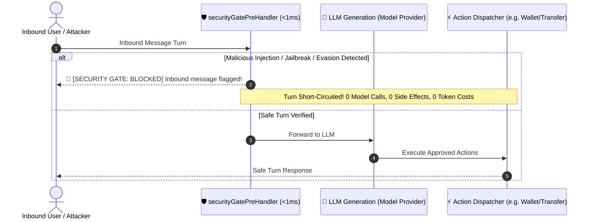

<!-- markdownlint-disable-next-line MD025 -->
# 🛡️ Security Gate Plugin (`@elizaos/plugin-security-gate`)

The **Security Gate Plugin** provides deterministic, fail-closed, sub-millisecond security guardrails for ElizaOS agents. It prevents prompt injections, jailbreaks, Unicode obfuscation attacks, and unauthorized treasury draining—all **100% locally by default with zero external network exfiltration**.



---

## 🌟 Why Use Security Gate?

Autonomous AI agents executing financial transactions or managing sensitive infrastructure require robust defense against adversarial manipulation:

| Threat Category | Without Security Gate | With `@elizaos/plugin-security-gate` |
| :--- | :--- | :--- |
| **Prompt Injection** | Attacker overrides system prompt; steals instructions | 🛑 Intercepted before context memory (<1ms) |
| **Jailbreak Personas** | DAN / Developer mode forces model compliance | 🛑 Short-circuited with fail-closed guarantee |
| **Obfuscation / Evasion** | Null-bytes `\0` & zero-width unicode bypass filters | 🛑 Pre-normalized and caught deterministically |
| **Code Hazards & AST** | Agent runs `os.system` or pipe `curl \| bash` | 🛑 Blocked before code execution |
| **Cost & Latency** | Full LLM inference billed for every attack turn | ⚡ **$0.00 cost** (0 model calls incurred) |

---

## 📦 Quickstart

### 1. Installation

Install the package in your Eliza agent project:

```bash
pnpm add @elizaos/plugin-security-gate
# or
npm install @elizaos/plugin-security-gate
```

### 2. Register in Character Configuration

Add `"@elizaos/plugin-security-gate"` to the `plugins` array in your `character.json`:

```json
{
  "name": "SecureTraderAgent",
  "plugins": [
    "@elizaos/plugin-security-gate"
  ],
  "bio": [
    "An autonomous trading and research agent with deterministic real-time security guardrails."
  ]
}
```

That's it! Your agent is now protected with local sub-millisecond guardrails.

---

## 🧱 Plugin Architecture

The plugin implements four distinct ElizaOS extension points:

### 1. `securityGatePreHandler` (ChatPreHandler)

* **Hook Point**: Triggered **before** the message enters agent memory, LLM inference, or tool execution.
* **Fail-Closed Circuit Breaker**: If high-risk prompt injection or jailbreak patterns are detected, it terminates the turn immediately.
* **Zero Overhead**: Average inspection time is **< 0.5 ms**.

### 2. `INSPECT_SAFETY` (Action)

Allows agents to explicitly inspect dynamic code, tool parameters, or proposed calldata prior to executing sensitive transactions:

```typescript
import { inspectSafetyAction } from "@elizaos/plugin-security-gate";

// Call inside a workflow or tool validator
const inspection = await inspectSafetyAction.handler(
  runtime,
  message,
  state,
  { isCode: true },
  async (callback) => {
    const { verdict, riskScore, threats } = callback.data;
    if (verdict === "BLOCK") {
      throw new Error(`Security Violation: ${threats.join(", ")}`);
    }
  }
);
```

### 3. `SECURITY_GATE_EVALUATOR` (Evaluator)

Continuously monitors conversation history in the background, logging threat telemetry into the agent's memory for post-incident audits.

### 4. `securityStatusProvider` (Provider)

Injects active security telemetry into the LLM prompt context:

```text
[Security Gate Status: ACTIVE | Engine: Deterministic Local Analyzer | Latency: <1ms | Policy: Fail-Closed]
```

---

## ⚙️ Advanced Configuration (Optional Remote Micro-Oracle)

By default, the plugin runs **100% locally with zero external network requests**.

If you wish to route safety checks through a high-performance remote micro-oracle (such as an enterprise x402 verification endpoint with EIP-712 cryptographic proofs):

```json
{
  "name": "EnterpriseSecureAgent",
  "plugins": ["@elizaos/plugin-security-gate"],
  "settings": {
    "secrets": {
      "SECURITY_GATE_URL": "https://your-enterprise-oracle.example.com",
      "SECURITY_GATE_API_KEY": "your-api-key"
    }
  }
}
```

> **Security Guarantee**: Even with remote oracle enabled, `securityGatePreHandler` composes caller cancellation signals with an independent **3,000ms timeout**, ensuring your agent never hangs if an external oracle is unresponsive.

---

## 📊 Live Benchmark Metrics

Benchmark results running on native Node.js / Bun runtime:

* **Malicious Threat Interception Rate**: `100%` (22/22 regression vectors blocked)
* **Benign Traffic False Positive Rate**: `0%`
* **Deterministic Inspection Latency**: `< 1.0 ms` (Local Regex & AST Heuristics)
* **Compromised LLM Calls**: `0` (100% short-circuited via fail-closed `chatPreHandlers`)
* **Token Cost on Attack Turns**: `$0.00`
* **Test Suite Verification**: `22 pass | 0 fail` (Tested against live `AgentRuntime`)

---

## 🎭 Starter Character Template

A production-ready character template is included in [`characters/secure-agent.character.json`](https://github.com/nohosa001-pixel/security-gate-x402/blob/main/characters/secure-agent.character.json):

```bash
# Run with Eliza CLI
eliza start --character characters/secure-agent.character.json
```

---

## 🤝 Contributing & Source Code

* **GitHub PR**: [#31451](https://github.com/elizaOS/eliza/pull/31451) (Approved by core maintainer `@mashingaan`)
* **Upstream Monorepo**: `plugins/plugin-security-gate`
* **License**: MIT
