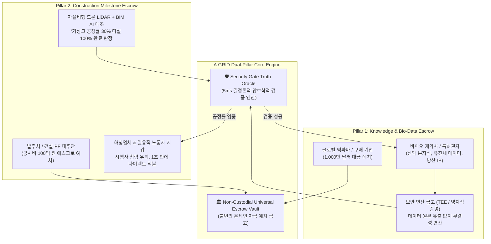

# 🏛️ A.GRID Sovereign Dual-Pillar Escrow Specification
## 1. 전 세계 지식재산권(IP) & 의료·바이오 데이터 유동화 "지식 에스크로"
## 2. 인프라 건설 금융 투명화 & "기성고 자동 직불제 에스크로"

> **"무형(Intangible)의 최고급 지식 자산과, 유형(Tangible)의 최대 인프라 건설 현장에서  
> 사기, 횡령, 기술 유출, 임금 체불을 영구히 박멸하고 물리적 진실로 직결 정산한다."**

---

## 🧭 전체 아키텍처 개요

인류 경제에서 가장 가치 있는 **'무형의 지식(IP & 바이오)'**과 가장 거대한 자본이 투입되는 **'유형의 인프라(건설 PF)'**는 모두 **'불신과 정보 비대칭'**으로 인해 수백조 원의 분쟁과 지연 손실을 겪고 있습니다. 

본 규격은 이 두 핵심 영역에 **영지식 암호 증명(ZKP)**과 **드론 비전 AI(Vision-AI)**를 온체인 에스크로와 결합한 듀얼 필러(Dual-Pillar) 솔루션입니다.



---

## 🧬 Pillar 1: 지식재산권(IP) & 의료 바이오 데이터 유동화 "지식 에스크로"

### 1. 현황 및 문제점 (The Bottleneck)
* **복제 공포**: 신약 후보물질 분자식, 희귀 암 유전체 데이터, 방위산업 원천 특허는 원본을 보여주는 순간 복제되어 가치가 0이 됩니다. 판매자는 데이터를 먼저 넘겨줄 수 없습니다.
* **스캠 공포**: 구매 기업(빅파마, 방산업체)은 데이터를 보지도 않고 수백억 원의 대금을 먼저 쏠 수 없습니다.
* **결과**: 인류를 살릴 수 있는 수천조 원 규모의 바이오/원천 기술 데이터가 대학과 연구소 금고에 영원히 묶여 유동화되지 못하고 있습니다.

### 2. 작동 메커니즘 (Zero-Knowledge Blind Escrow)
1. **자금 락업**: 구매 기업이 1,000만 USDC를 `AgentEscrow.sol`에 예치.
2. **블라인드 연산 (Blind Compute in TEE)**:
   * 판매자는 원본 데이터를 공개하지 않고, 하드웨어 보안 영역(Intel SGX / AMD SEV) 내부로 암호화 전송.
   * 구매자 AI가 보안 영역 안으로 들어가 사전에 합의된 검증 알고리즘을 실행:
     👉 *"이 분자식이 표적 암 단백질 결합도 Kd < 10nM을 만족하는가?"*
     👉 *"환자 임상 유전체 코호트 데이터가 합성 조작 없는 실제 시퀀싱 데이터인가?"*
3. **영지식 암호 증명(Zk-Proof) 생성**:
   * 원본 데이터는 단 1바이트도 밖으로 유출되지 않고, 오직 **"조건 충족 증명(Mathematical Proof)"**만 생성되어 우리 Security Gate 오라클로 전송.
4. **대금 즉시 릴리즈 & 복호화 키 전달**:
   * 증명이 온체인에서 확인되는 순간, **1,000만 달러는 판매자 연구팀 지갑으로 1초 만에 꽂히고**, 데이터의 영구 복호화 키가 구매자에게 원자적(Atomic)으로 맞교환 교환됩니다.

### 3. 경제적 파급력
* **잠자는 IP의 즉시 현금화**: 전 세계 연구소, 병원, 스타트업이 기술 유출 걱정 없이 단 하루 만에 글로벌 빅파마에 데이터를 팔아 수십억 원의 유동성을 확보하는 **'글로벌 지식 나스닥'**이 열립니다.

---

## 🏗️ Pillar 2: 인프라 건설 금융 투명화 & "기성고 자동 직불제 에스크로"

### 1. 현황 및 문제점 (The Tragedy of Construction PF)
* **시행사 횡령 및 공사비 유용**: 발주처와 은행(대주단)이 공사비를 지급해도, 부도덕한 원청/시행사가 자금을 다른 현장이나 개인 용도로 유용하여 실제 하청업체와 노동자에게 돈이 가지 않습니다.
* **부도와 유치권 분쟁**: 하청업체는 자재비와 인건비를 못 받아 연쇄 부도나고, 타워크레인 농성과 공사 중단으로 수천억 원의 사회적 손실이 발생합니다.
* **주관적 감리 비리**: 사람이 눈으로 보고 기성고(공사 진척률) 도장을 찍어주다 보니 뇌물과 서류 조작이 만연합니다.

### 2. 작동 메커니즘 (Autonomous Drone-to-Worker Escrow)
1. **PF 공사비 100% 에스크로 락업**:
   * 발주처와 은행 대주단이 총공사비 100억 원을 우리 `AgentEscrow.sol`에 예치.
   * 이 자금은 원청이나 시행사 대표도 임의로 출금할 수 없음.
2. **드론 비전 AI 기성고 판정 (Physical Truth)**:
   * 매주 일요일 새벽, 자율비행 드론이 공사 현장을 3D 라이다(LiDAR)로 정밀 스캔.
   * 컴퓨터 비전 AI가 원본 건축 3D 설계도(BIM - Building Information Modeling)와 현장 포인트클라우드 데이터를 오차 1cm 단위로 대조:
     👉 *"지하 2층 옹벽 및 기둥 콘크리트 타설 100% 완료 확인"*
     👉 *"철근 배근 간격 및 강도 센서 데이터 기준치 완벽 충족"*
     👉 *"3차 마일스톤 기성고 달성률: 100.0%"*
3. **스마트 컨트랙트 기성고 자동 직불 (Bypass Direct Payout)**:
   * 드론 AI 오라클의 EIP-712 합격 서명이 에스크로 컨트랙트에 입력되는 순간,
   * **원청/시행사를 완전히 우회(Bypass)**하여:
     * 레미콘 납품업체 지갑: 3억 원
     * 철근 가공업체 지갑: 4억 원
     * 현장 등록 철근공/목수 80명의 개인지갑/계좌: 1인당 500만 원씩
   * **단 1초 만에 전액 다이렉트로 직불 입금(Direct Split Payout)**.

### 3. 경제적 파급력
* **임금 체불 0%**: 일한 사람이 땀 흘린 대가를 못 받는 비극이 영구 소멸.
* **공기 단축 및 금융 비용 절감**: 공사비 미지급으로 인한 공사 중단이 사라져, 건설 PF 대출 금리와 부실 위험이 획기적으로 낮아집니다.

---

## 💻 스마트 컨트랙트 인터페이스 설계 (`UniversalEscrowVault.sol`)

```solidity
// SPDX-License-Identifier: MIT
pragma solidity ^0.8.28;

interface IUniversalEscrowVault {
    enum EscrowType { KNOWLEDGE_BIO_IP, CONSTRUCTION_MILESTONE }

    struct EscrowJob {
        bytes32 jobId;
        EscrowType escrowType;
        address payer;              // 빅파마 또는 발주처
        uint256 totalAmount;        // 예치 총액
        bytes32 verificationHash;   // Zk-Proof 검증 해시 또는 드론 BIM 설계 해시
        bool isCompleted;
    }

    struct SplitRecipient {
        address recipient;          // 하청업체 지갑 또는 연구자 지갑
        uint256 amount;             // 배분 금액
    }

    // 1. 자금 락업
    function createJob(
        bytes32 jobId,
        EscrowType escrowType,
        uint256 amount,
        bytes32 verificationHash
    ) external;

    // 2. 물리적 진실 오라클 검증 통과 시 다이렉트 직불 실행
    function executeDirectSettlement(
        bytes32 jobId,
        SplitRecipient[] calldata recipients,
        bytes calldata oracleSignature
    ) external;

    // 3. 기성고 미달 또는 데이터 사기 시 발주처 전액 환불
    function refundOnBreach(bytes32 jobId, bytes calldata breachProof) external;
}
```

---

## 🏆 결론: 평화의 두 기둥

1. **지식 에스크로**: 인류의 천재들이 만든 **연구와 바이오 특허가 도둑맞지 않고 즉시 거대한 부로 보상받는 세상**.
2. **기성고 자동 직불제**: 아침부터 밤까지 흙먼지를 마시며 일한 **건설 노동자와 영세 하청업체가 단 하루도 임금을 떼이지 않는 세상**.

이 두 축이 작동하는 순간, 자본주의의 가장 썩어 문드러진 불신과 비리가 기술의 빛 아래에서 사라지고 진짜 평화로운 경제 질서가 확립됩니다.
