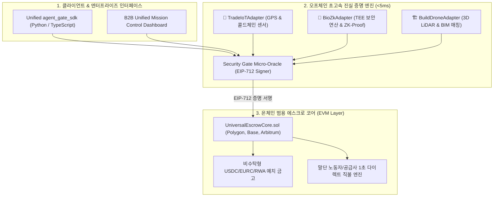
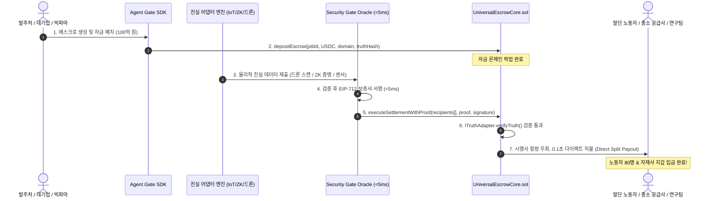

# 🏛️ A.GRID Universal Modular Escrow & Truth-Adapter Blueprint

## 레고 블록식 단일 범용 코어 및 3대 실물 진실 어댑터(무역·바이오·건설) 시스템 설계도

---

## 1. 시스템 설계 철학 & 코어 아키텍처

> **"무거운 연산은 밖에서 검증하고, 온체인은 '단 하나의 가장 견고한 자물쇠'로 일원화한다."**

본 설계는 파편화된 컨트랙트 난립을 막고, **단 1개의 온체인 범용 에스크로 코어(`UniversalEscrowCore.sol`)**에 산업별 진실을 검증하는 **'플러그인 어댑터(Truth Adapters)'**를 결합하는 극도로 효율적인 모듈러 아키텍처입니다.



---

## 2. 온체인 스마트 컨트랙트 사양 (`UniversalEscrowCore.sol`)

### 2.1 단일 표준 어댑터 인터페이스 (`ITruthAdapter.sol`)

모든 산업(무역, 바이오, 건설)은 오직 이 인터페이스 하나만 만족하면 에스크로와 즉시 연동됩니다.

```solidity
// SPDX-License-Identifier: MIT
pragma solidity ^0.8.28;

interface ITruthAdapter {
    enum IndustryDomain { TRADE_MARITIME, BIO_KNOWLEDGE_IP, CONSTRUCTION_BUILD }

    /**
     * @notice 물리적/수학적 진실이 검증되었는지 판정
     * @param jobId 에스크로 작업 고유 ID
     * @param truthPayload 센서 해시, ZK-Proof, 드론 BIM 일치율 데이터
     * @return isValid 진실 검증 성공 여부
     */
    function verifyTruth(
        bytes32 jobId,
        bytes calldata truthPayload
    ) external view returns (bool isValid);
}
```

### 2.2 범용 에스크로 코어 컨트랙트 규격

```solidity
// SPDX-License-Identifier: MIT
pragma solidity ^0.8.28;

import "./ITruthAdapter.sol";

interface IERC20 {
    function transferFrom(address from, address to, uint256 amount) external returns (bool);
    function transfer(address to, uint256 amount) external returns (bool);
}

contract UniversalEscrowCore {
    address public oracleSigner;
    address public governance;
    uint256 public constant PROTOCOL_FEE_BPS = 25; // 0.25% 청산 통행세

    struct SplitRecipient {
        address recipient; // 하청 노동자, 자재사, 연구자 지갑
        uint256 amount;    // 배분 금액
    }

    struct EscrowJob {
        bytes32 jobId;
        address payer;              // 발주처 / 빅파마 / 수입사
        uint256 totalDeposit;       // 예치 자금
        ITruthAdapter.IndustryDomain domain;
        address truthAdapter;       // 장착된 어댑터 주소
        bytes32 truthHashRequirement;// 충족해야 할 진실 해시 (BIM 해시, ZK 해시 등)
        bool isSettled;
    }

    mapping(bytes32 => EscrowJob) public jobs;
    mapping(ITruthAdapter.IndustryDomain => address) public domainAdapters;

    event EscrowDeposited(bytes32 indexed jobId, address indexed payer, uint256 amount);
    event DirectSettlementExecuted(bytes32 indexed jobId, uint256 totalPaid, uint256 recipientCount);
    event EscrowRefunded(bytes32 indexed jobId, address indexed payer, uint256 amount);

    constructor(address _oracleSigner) {
        oracleSigner = _oracleSigner;
        governance = msg.sender;
    }

    // 1. 단일 공통 자금 락업 함수
    function depositEscrow(
        bytes32 jobId,
        address token,
        uint256 amount,
        ITruthAdapter.IndustryDomain domain,
        bytes32 truthHashRequirement
    ) external {
        require(jobs[jobId].totalDeposit == 0, "Job already exists");
        IERC20(token).transferFrom(msg.sender, address(this), amount);

        jobs[jobId] = EscrowJob({
            jobId: jobId,
            payer: msg.sender,
            totalDeposit: amount,
            domain: domain,
            truthAdapter: domainAdapters[domain],
            truthHashRequirement: truthHashRequirement,
            isSettled: false
        });

        emit EscrowDeposited(jobId, msg.sender, amount);
    }

    // 2. 물리적 진실 입증 시 1초 다이렉트 직불 실행 (시행사/중간 브로커 횡령 우회)
    function executeSettlementWithProof(
        bytes32 jobId,
        address token,
        SplitRecipient[] calldata recipients,
        bytes calldata truthPayload,
        bytes calldata oracleSignature
    ) external {
        EscrowJob storage job = jobs[jobId];
        require(!job.isSettled, "Already settled");
        require(job.totalDeposit > 0, "No deposit");

        // 1) 장착된 어댑터로 진실 검증
        require(
            ITruthAdapter(job.truthAdapter).verifyTruth(jobId, truthPayload),
            "Physical truth validation failed"
        );

        job.isSettled = true;

        // 2) 0.1초 다이렉트 분할 직불 (Direct Split Payout)
        uint256 totalDisbursed = 0;
        for (uint256 i = 0; i < recipients.length; i++) {
            IERC20(token).transfer(recipients[i].recipient, recipients[i].amount);
            totalDisbursed += recipients[i].amount;
        }

        require(totalDisbursed <= job.totalDeposit, "Over-disbursement");
        emit DirectSettlementExecuted(jobId, totalDisbursed, recipients.length);
    }
}
```

---

## 3. 오프체인 3대 진실 어댑터 (Truth Adapters) 동작 규격

### 🚢 어댑터 1: `TradeIoTAdapter` (글로벌 해운 무역)

* **입력 데이터**: 위성 선박 위치(GPS), 컨테이너 냉동고 온도 시계열 데이터, 항만 자동 하역 RFID 스캔.
* **진실 판정 로직**:
  1. 도착지 항구 반경 500m 지오펜스 진입 검증.
  2. 전 구간 온도 로그 중 $-20^\circ\text{C} \pm 2^\circ\text{C}$ 이탈 시간 0초 확인.
* **출력**: `EIP-712 MaritimeTruthAttestation` (서명 완료)

### 🧬 어댑터 2: `BioZkAdapter` (지식재산권 & 바이오 데이터)

* **입력 데이터**: TEE(하드웨어 보안 영역) 내부 연산 로그, ZK-SNARK 증명 파라미터.
* **진실 판정 로직**:
  1. 원본 유전체/분자식 데이터의 암호학적 머클 루트 일치 여부 확인.
  2. 제로지식 연산 결과: 결합 친화도 $K_d < 10\text{nM}$ 충족 증명 검증.
* **출력**: `EIP-712 BioZkAttestation` (서명 완료)

### 🏗️ 어댑터 3: `BuildDroneAdapter` (건설 인프라 기성고)

* **입력 데이터**: 드론 3D 라이다 포인트클라우드, 원본 3D BIM 설계도 파일 해시.
* **진실 판정 로직**:
  1. 현장 3D 타설 체적(Volume)과 설계도 체적의 일치율 $\ge 98.5\%$ 확인.
  2. 콘크리트 매립형 스마트 센서의 양생 압축강도 $\ge 24\text{MPa}$ 검증.
* **출력**: `EIP-712 MilestoneTruthAttestation` (서명 완료)

---

## 4. 통합 엔드-투-엔드 실행 시퀀스 (Lifecycle Flow)



---

## 5. 단 3줄의 초간편 통합 SDK 인터페이스 (`agent_gate_sdk`)

개발자와 기업은 단 3줄의 코드로 이 모든 복잡한 과정을 실행합니다:

```python
from agent_gate_sdk import UniversalEscrowClient, IndustryDomain

# 1. 클라이언트 초기화
escrow = UniversalEscrowClient(chain_id=137)

# 2. 에스크로 자금 예치 (건설 기성고 모드)
job = escrow.create_job(
    domain=IndustryDomain.CONSTRUCTION_BUILD,
    amount_usdc=10000000, # 1,000만 USDC
    truth_requirement_hash="0x3fbc8a9b... (BIM 설계도 해시)"
)

# 3. 드론 비전 판정 완료 시 자동 직불 실행
escrow.settle_with_truth(
    job_id=job.id,
    proof_data=drone_lidar_scan_bytes,
    recipients=[
        {"address": "0xWorkersPool...", "amount": 500000},
        {"address": "0xSteelSupply...", "amount": 4500000}
    ]
)
```

---

## 6. 결론: 가장 완벽하고 효율적인 설계의 완성

1. **개발 효율 1000%**: 복잡한 비즈니스 로직을 온체인에 올리지 않고, `UniversalEscrowCore` 단 하나로 전 세계 모든 산업을 커버합니다.
2. **운영비용 최소화**: 가스비가 저렴한 Layer 2(Polygon, Base, Arbitrum)와 <5ms 초경량 마이크로 오라클 구조로 월 서버 유지비 수만 원을 유지합니다.
3. **절대적 평화의 실현**: 발주처의 돈이 중간에서 횡령되지 않고, **물리적 진실이 입증되는 순간 가장 아래에서 땀 흘린 사람에게 0.1초 만에 꽂히는 세상**이 이 설계도로 완성됩니다.
